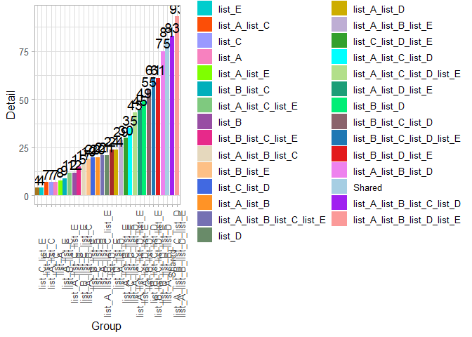
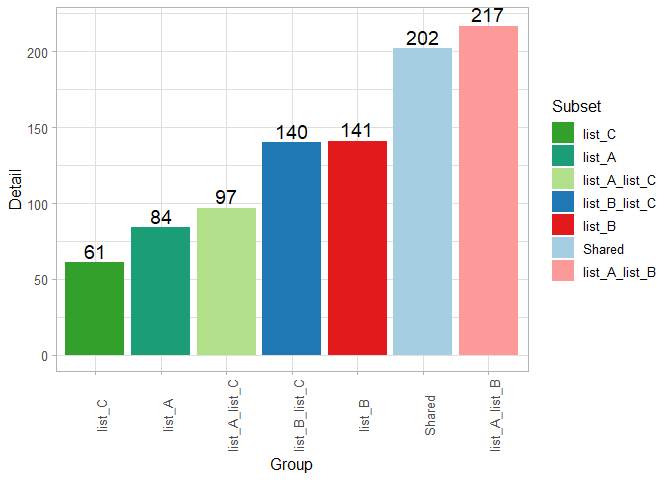
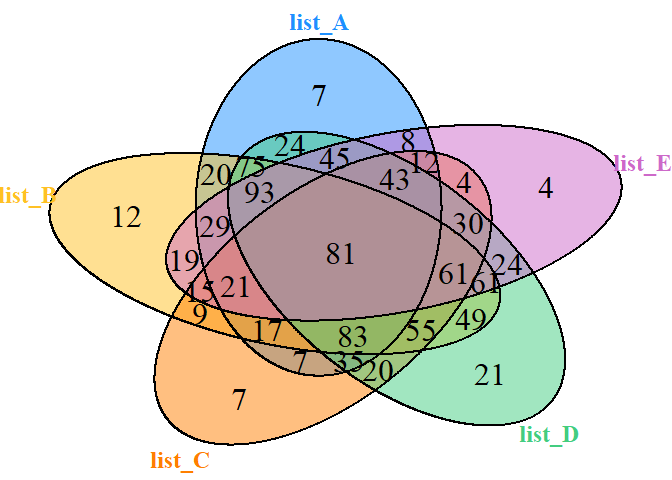
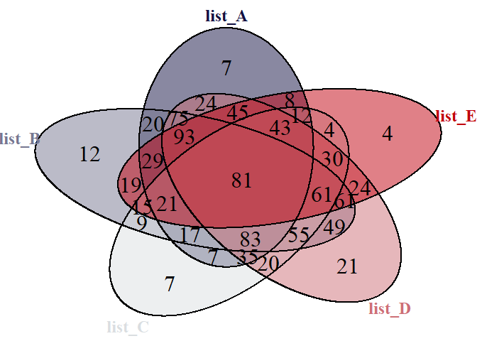
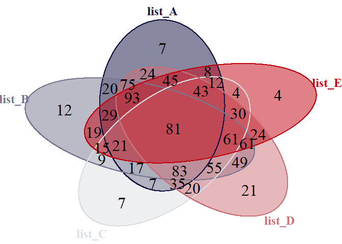
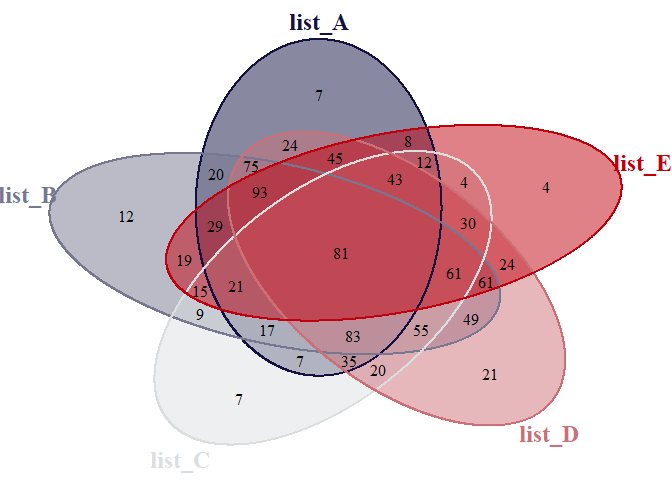
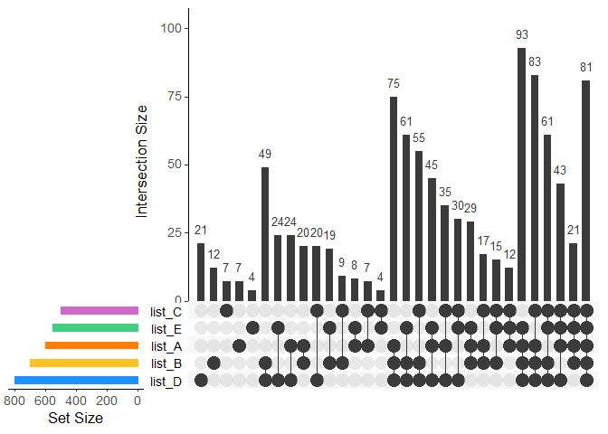
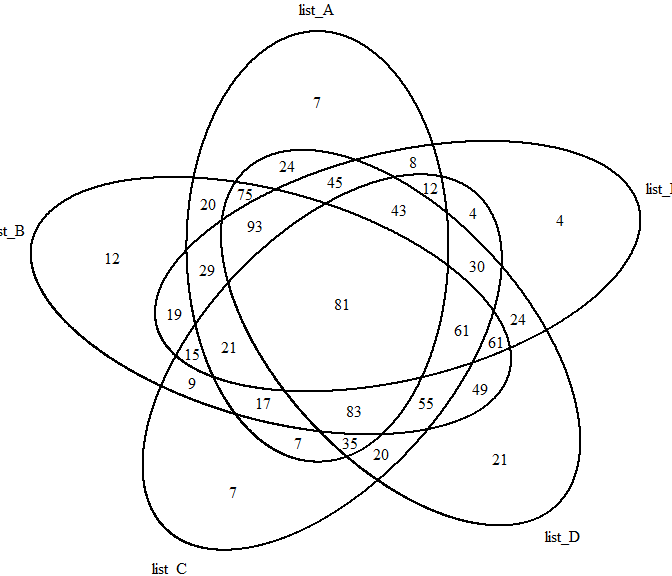
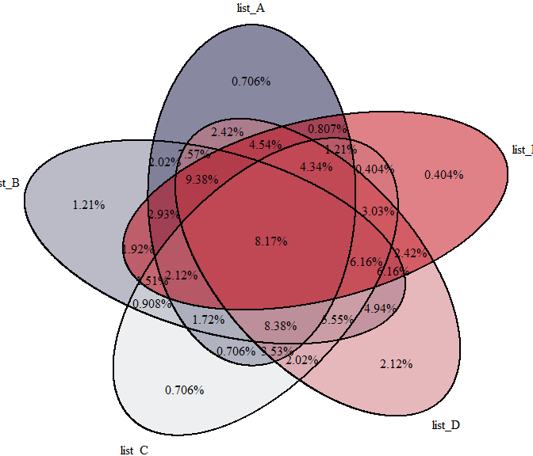
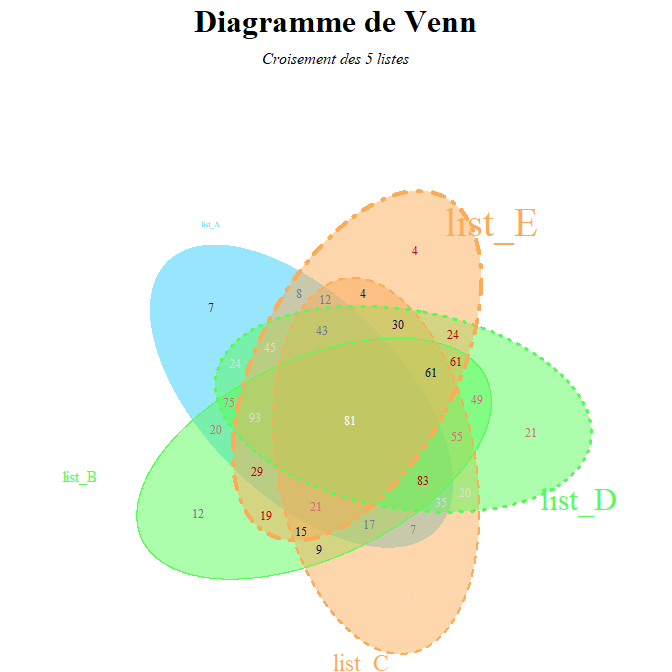

Diagramme de Venn
================
Laurent Cauquil
2019-11-05

  - [Introduction](#introduction)
  - [Installation du package à partir du dépôt
    Bioconductor](#installation-du-package-à-partir-du-dépôt-bioconductor)
  - [Jeu de données](#jeu-de-données)
  - [Création d’un objet de type
    `venn`](#création-dun-objet-de-type-venn)
  - [Diagramme de venn avec le package
    `VennDiagram`](#diagramme-de-venn-avec-le-package-venndiagram)
  - [Autres packages](#autres-packages)
  - [Création de diagramme de venn en
    ligne](#création-de-diagramme-de-venn-en-ligne)

## Introduction

### Objectif:

Représenter sous forme d’ensembles chevauchant des similitudes ou des
différences entre plusieurs listes d’éléments

### Données entrées:

  - Soit les effectifs correspondants à chacun des sous-ensembles
  - Soit les listes d’éléments des ensembles de départ

### Données de sorties:

  - Objet avec tous les effectifs de tous les sous-ensembles
  - Listes des éléments de tous les sous-ensembles (suivant données de
    départ et package)

### Diagrammes de sortie:

  - Lisibles jusqu’à 5 ensembles (graph possible jusqu’à 8-9)
  - Différentes formes (ellipses, cercles, carrés, ChowRuskey, Edwards…)
  - Taille peut être proportionnelle aux effectifs
  - Autres types de représentation: Vennpie, Upset

Il existe pas mal de packages qui permettent de tracer des diagrammes de
Venn à la fois sur le CRAN et Bioconductor

La plupart ne prennent en entrée que les effectifs des ensembles et des
sous-ensembles, on ne peut pas revenir aux éléments constitutifs des
sous-ensembles

Certains sont personnalisables à loisirs mais ne produisent pas
forcement de jolis diagrammes et inversement  
Difficile de s’arrêter sur un seul package…

<Br><Br>

<center>

<font size = "6">Compromis avec le package `VennDetail` (Bioconductor)

</center>

</font>

<https://bioconductor.org/packages/release/bioc/html/VennDetail.html>
<Br><Br>

## Installation du package à partir du dépôt Bioconductor

``` r
if (!requireNamespace("BiocManager", quietly = TRUE))
    install.packages("BiocManager")

BiocManager::install("VennDetail")
```

## Jeu de données

On créé un jeu de données de 5 listes de numéros pris entre 0 et 1000,
et d’effectifs entre 500 et 800.

``` r
set.seed(123)
list_No <- list(list_A = paste0("No_", sample(x = 1000, size = 600, replace = F)),
                 list_B = paste0("No_", sample(x = 1000, size = 700, replace = F)),
                 list_C = paste0("No_", sample(x = 1000, size = 500, replace = F)),
                 list_D = paste0("No_", sample(x = 1000, size = 800, replace = F)),
                 list_E = paste0("No_", sample(x = 1000, size = 550, replace = F)))
str(list_No)
## List of 5
##  $ list_A: chr [1:600] "No_415" "No_463" "No_179" "No_526" ...
##  $ list_B: chr [1:700] "No_206" "No_124" "No_592" "No_775" ...
##  $ list_C: chr [1:500] "No_912" "No_751" "No_167" "No_608" ...
##  $ list_D: chr [1:800] "No_860" "No_568" "No_296" "No_63" ...
##  $ list_E: chr [1:550] "No_110" "No_696" "No_844" "No_321" ...
```

## Création d’un objet de type `venn`

``` r
library(VennDetail)
venn_No <- venndetail(list_No)
venn_No
## === Here is the detail of Venndiagram ===
## Total results:  991 x 2 
## Total sets is: 31 
##   Subset Detail
## 1 Shared No_179
## 2 Shared No_526
## 3 Shared No_374
## 4 Shared No_665
## 5 Shared No_602
## 6 Shared No_544
## ... with 985 more rows ...
```

**Il y a 5 listes, qui conduisent à 2^5 sous-ensembles soit 32 effectifs
à calculer (en comptant l’ensemble total**)

### Résumé de l’objet `venn_No`

``` r
summary(venn_No)
## Input groups are:  list_A list_B list_C list_D list_E 
## Total unique elements are:  991 
## Total subsets are:  31 
## ====== Subsets detail: ======
##                      Shared list_B_list_C_list_D_list_E 
##                          81                          61 
## list_A_list_C_list_D_list_E        list_C_list_D_list_E 
##                          43                          30 
## list_A_list_B_list_D_list_E        list_B_list_D_list_E 
##                          93                          61 
##        list_A_list_D_list_E               list_D_list_E 
##                          45                          24 
## list_A_list_B_list_C_list_E        list_B_list_C_list_E 
##                          21                          15 
##        list_A_list_C_list_E               list_C_list_E 
##                          12                           4 
##        list_A_list_B_list_E               list_B_list_E 
##                          29                          19 
##               list_A_list_E                      list_E 
##                           8                           4 
## list_A_list_B_list_C_list_D        list_B_list_C_list_D 
##                          83                          55 
##        list_A_list_C_list_D               list_C_list_D 
##                          35                          20 
##        list_A_list_B_list_D               list_B_list_D 
##                          75                          49 
##               list_A_list_D                      list_D 
##                          24                          21 
##        list_A_list_B_list_C               list_B_list_C 
##                          17                           9 
##               list_A_list_C                      list_C 
##                           7                           7 
##               list_A_list_B                      list_B 
##                          20                          12 
##                      list_A 
##                           7
```

### Barplot des effectifs

#### Représentation en barplot des effectifs des sous-ensembles

Pas très visible, avec 5 listes il y a 31 barres

``` r
dplot(venn_No, order = T)
```

<!-- -->

#### Représentation en barplot des effectifs pour les 3 premières listes

``` r
dplot(venndetail(list_No[1:3]), order = T)
```

<!-- -->

### Extraction de résultats

On peut extraire les listes de No de chacun des sous-ensembles

Listes des différents sous-ensembles

``` r
names(detail(venn_No))
##  [1] "Shared"                      "list_B_list_C_list_D_list_E"
##  [3] "list_A_list_C_list_D_list_E" "list_C_list_D_list_E"       
##  [5] "list_A_list_B_list_D_list_E" "list_B_list_D_list_E"       
##  [7] "list_A_list_D_list_E"        "list_D_list_E"              
##  [9] "list_A_list_B_list_C_list_E" "list_B_list_C_list_E"       
## [11] "list_A_list_C_list_E"        "list_C_list_E"              
## [13] "list_A_list_B_list_E"        "list_B_list_E"              
## [15] "list_A_list_E"               "list_E"                     
## [17] "list_A_list_B_list_C_list_D" "list_B_list_C_list_D"       
## [19] "list_A_list_C_list_D"        "list_C_list_D"              
## [21] "list_A_list_B_list_D"        "list_B_list_D"              
## [23] "list_A_list_D"               "list_D"                     
## [25] "list_A_list_B_list_C"        "list_B_list_C"              
## [27] "list_A_list_C"               "list_C"                     
## [29] "list_A_list_B"               "list_B"                     
## [31] "list_A"
```

La fonction `getSet()` permet d’extraire le détail d’un ou plusieurs
sous-ensembles

``` r
## intersection des list_A et list_B
list_A_B <- getSet(venn_No, c("list_A_list_B"))
head(list_A_B)
##          Subset Detail
## 1 list_A_list_B  No_91
## 2 list_A_list_B No_953
## 3 list_A_list_B No_519
## 4 list_A_list_B No_880
## 5 list_A_list_B No_785
## 6 list_A_list_B No_744
```

“Shared” donne la liste des No communs aux 5 listes (attention à la
majuscule)

``` r
## No présents dans les 5 ensembles
shared_No <- getSet(venn_No, c("Shared"))
head(shared_No)
##   Subset Detail
## 1 Shared No_179
## 2 Shared No_526
## 3 Shared No_374
## 4 Shared No_665
## 5 Shared No_602
## 6 Shared No_544
```

Mais on peut faire mieux 😃

Le détail des sous-ensembles se trouve dans `Venn_No@result`

``` r
str(venn_No@result)
## 'data.frame':    991 obs. of  2 variables:
##  $ Subset: Factor w/ 31 levels "list_A","list_A_list_B",..: 31 31 31 31 31 31 31 31 31 31 ...
##  $ Detail: Factor w/ 991 levels "No_1","No_10",..: 89 470 304 622 554 489 819 909 132 530 ...
```

``` r
result <- data.frame(venn_No@result)

list_result <- vector("list", length(levels(result$Subset)))

for (i in seq(length(list_result)))
{
  list_result[[i]] <- as.character(result[result$Subset == levels(result$Subset)[i],2])
  names(list_result)[i] <- levels(result$Subset)[i]
}
```

``` r
str(list_result)
## List of 31
##  $ list_A                     : chr [1:7] "No_774" "No_500" "No_235" "No_219" ...
##  $ list_A_list_B              : chr [1:20] "No_91" "No_953" "No_519" "No_880" ...
##  $ list_A_list_B_list_C       : chr [1:17] "No_39" "No_310" "No_792" "No_185" ...
##  $ list_A_list_B_list_C_list_D: chr [1:83] "No_195" "No_979" "No_211" "No_143" ...
##  $ list_A_list_B_list_C_list_E: chr [1:21] "No_415" "No_840" "No_26" "No_89" ...
##  $ list_A_list_B_list_D       : chr [1:75] "No_229" "No_621" "No_224" "No_575" ...
##  $ list_A_list_B_list_D_list_E: chr [1:93] "No_463" "No_244" "No_709" "No_348" ...
##  $ list_A_list_B_list_E       : chr [1:29] "No_603" "No_649" "No_555" "No_871" ...
##  $ list_A_list_C              : chr [1:7] "No_14" "No_768" "No_593" "No_294" ...
##  $ list_A_list_C_list_D       : chr [1:35] "No_426" "No_23" "No_309" "No_135" ...
##  $ list_A_list_C_list_D_list_E: chr [1:43] "No_938" "No_118" "No_299" "No_932" ...
##  $ list_A_list_C_list_E       : chr [1:12] "No_937" "No_862" "No_567" "No_900" ...
##  $ list_A_list_D              : chr [1:24] "No_818" "No_865" "No_895" "No_85" ...
##  $ list_A_list_D_list_E       : chr [1:45] "No_590" "No_166" "No_859" "No_116" ...
##  $ list_A_list_E              : chr [1:8] "No_308" "No_483" "No_428" "No_935" ...
##  $ list_B                     : chr [1:12] "No_206" "No_531" "No_449" "No_631" ...
##  $ list_B_list_C              : chr [1:9] "No_599" "No_71" "No_929" "No_383" ...
##  $ list_B_list_C_list_D       : chr [1:55] "No_945" "No_167" "No_579" "No_46" ...
##  $ list_B_list_C_list_D_list_E: chr [1:61] "No_124" "No_332" "No_425" "No_271" ...
##  $ list_B_list_C_list_E       : chr [1:15] "No_281" "No_776" "No_628" "No_719" ...
##  $ list_B_list_D              : chr [1:49] "No_45" "No_839" "No_750" "No_829" ...
##  $ list_B_list_D_list_E       : chr [1:61] "No_740" "No_653" "No_896" "No_169" ...
##  $ list_B_list_E              : chr [1:19] "No_592" "No_787" "No_909" "No_416" ...
##  $ list_C                     : chr [1:7] "No_213" "No_911" "No_214" "No_182" ...
##  $ list_C_list_D              : chr [1:20] "No_360" "No_587" "No_216" "No_532" ...
##  $ list_C_list_D_list_E       : chr [1:30] "No_583" "No_550" "No_325" "No_254" ...
##  $ list_C_list_E              : chr [1:4] "No_868" "No_314" "No_173" "No_439"
##  $ list_D                     : chr [1:21] "No_958" "No_176" "No_192" "No_675" ...
##  $ list_D_list_E              : chr [1:24] "No_898" "No_640" "No_790" "No_781" ...
##  $ list_E                     : chr [1:4] "No_15" "No_50" "No_257" "No_746"
##  $ Shared                     : chr [1:81] "No_179" "No_526" "No_374" "No_665" ...
```

``` r
library(openxlsx)
write.xlsx(list_result, file = "list_result.xlsx", colNames = T)
```

<Br><Br>

<center>

<font size = "6">Représentation graphique

</center>

</font>

### Diagramme de venn avec package `VennDetail`

Fonction `plot()` de `VennDetail` avec les paramètres par défaut

``` r
plot(venn_No)
```

<!-- -->

### On peut contrôler différents paramètres:

  - Couleur des ensembles

<!-- end list -->

``` r
## chargement de la library contenant des palettes
library(gameofthrones)
## création d'une palette a 5 couleurs à partir de la palette "tully" de GOT
pal_tully = got(5, option = "tully")
## affichage de la palette avec le package pals
pals::pal.bands(pal_tully)
```

<!-- -->

``` r
plot(venn_No, 
     mycol = pal_tully)
```

<!-- -->

  - Couleur des bordures des ensembles identique aux ensembles

<!-- end list -->

``` r
plot(venn_No, 
     mycol = pal_tully, 
     col = pal_tully)
```

<!-- -->

  - Diminue la taille des labels dans les sous-ensembles

<!-- end list -->

``` r
plot(venn_No, 
     mycol = pal_tully, 
     col = pal_tully,
     cex = 1)
```

<!-- -->

### Représentation de type “upset”

Ce mode de représentation permet de visualiser clairement des jeux de
données avec de multiples combinaisons

``` r
plot(venn_No, type = "upset", nintersects = NA)
```

<!-- -->

<Br><Br>

## Diagramme de venn avec le package `VennDiagram`

<Br>

  - Jusqu’à 5 listes
  - Packages très complet au niveau du paramétrage du diagramme
    produit  
  - Reçoit en entrée une liste de vecteur
  - Exporte les graphs en .tiff, .svg, .png (qualité publication)
  - Récupération des listes des sous-ensembles pas immédiate

De part ses nombreux paramètres graphiques, le diagramme produit par
défaut est très simple. Il faut donc mettre un peu les mains dedans
pour le rendre attractif

Les diagrammes sont affichés directement avec la fonction `grid.draw` et
l’argument `file = NULL` dans la fonction `venn.diagram()`  
Les graphes sont exportables aux formats png, tiff et svg

Par défaut, `VennDiagram` un fichier log à chaque création de figure,
pour éviter ce comportement il faut lancer cette ligne de code en amont

`futile.logger::flog.threshold(futile.logger::ERROR, name =
"VennDiagramLogger")`

### Par défaut

``` r
library(VennDiagram)
## Loading required package: grid
## Loading required package: futile.logger
#venn.diagram(list_No, filename = "fig/dig_defaut.png", imagetype = "png")
grid.draw(venn.diagram(list_No, filename = NULL))
```

<!-- -->

### Avec la palette de couleurs “tully” et des pourcentages

``` r
grid.draw(venn.diagram(list_No, filename = NULL,
             fill = pal_tully,
             print.mode = "percent"))
```

<!-- -->

### Personnalisation

Aperçu de quelques paramètres:

<Br><Br>

``` r
grid.draw(venn.diagram(list_No, filename = NULL,
             ## rajoute un titre
             main = "Diagramme de Venn",
             ## taille du titre
             main.cex = 2,
             ## titre en gras
             main.fontface = "bold",
             ## rajoute un sous-titre
             sub = "Croisement des 5 listes",
             ## sous-titre en italique
             sub.fontface = "italic",
             ## taille du sous-titre
             sub.cex = 1,
             ## couleur de chaque label des ensembles
             cat.col = c("#2ECCFA", "#58FA58", "#FAAC58", "#58FA58", "#FAAC58"),
             ## epaisseur des contours des ensembles
             lwd = c(0,1,2,3,4),
             ## style des contours des ensembles
             lty = c(0,1,2,3,4),
             ## couleur des ensembles
             fill = c("#2ECCFA", "#58FA58", "#FAAC58", "#58FA58", "#FAAC58"),
             ## couleur des contours des ensembles
             col = c("#2ECCFA", "#58FA58", "#FAAC58", "#58FA58", "#FAAC58"),
             ## transparence des ensembles
             alpha = .5,
             ## taille des labels des ensembles
             cat.cex = c(.5, 1, 1.5, 2, 2.5),
             ## taille des labels de tous les sous-ensembles
             cex = .8, # rep(1,31),
             ## couleur des labels de chacun des sous-ensembles
             label.col = c(rep(pal_tully, 6), "white"),
             ## rotation de l'ensemble de la figure (reverse clockwise)
             rotation.degree = 45,
             ## distance du label à son ensemble (peut être négatif)
             cat.dist = c(0.2, 0.3, 0.2, 0.2, 0.2),
             ## espace autour du diagramme
             margin = .2))
```

<!-- -->

#### Détail du partitionnement des sous-ensembles

L’information est difficile à récupérer, c’est pourquoi il vaut mieux
utiliser `VennDetail` à cette étape

``` r
get.venn.partitions(list_No)
##    list_A list_B list_C list_D list_E
## 1    TRUE   TRUE   TRUE   TRUE   TRUE
## 2   FALSE   TRUE   TRUE   TRUE   TRUE
## 3    TRUE  FALSE   TRUE   TRUE   TRUE
## 4   FALSE  FALSE   TRUE   TRUE   TRUE
## 5    TRUE   TRUE  FALSE   TRUE   TRUE
## 6   FALSE   TRUE  FALSE   TRUE   TRUE
## 7    TRUE  FALSE  FALSE   TRUE   TRUE
## 8   FALSE  FALSE  FALSE   TRUE   TRUE
## 9    TRUE   TRUE   TRUE  FALSE   TRUE
## 10  FALSE   TRUE   TRUE  FALSE   TRUE
## 11   TRUE  FALSE   TRUE  FALSE   TRUE
## 12  FALSE  FALSE   TRUE  FALSE   TRUE
## 13   TRUE   TRUE  FALSE  FALSE   TRUE
## 14  FALSE   TRUE  FALSE  FALSE   TRUE
## 15   TRUE  FALSE  FALSE  FALSE   TRUE
## 16  FALSE  FALSE  FALSE  FALSE   TRUE
## 17   TRUE   TRUE   TRUE   TRUE  FALSE
## 18  FALSE   TRUE   TRUE   TRUE  FALSE
## 19   TRUE  FALSE   TRUE   TRUE  FALSE
## 20  FALSE  FALSE   TRUE   TRUE  FALSE
## 21   TRUE   TRUE  FALSE   TRUE  FALSE
## 22  FALSE   TRUE  FALSE   TRUE  FALSE
## 23   TRUE  FALSE  FALSE   TRUE  FALSE
## 24  FALSE  FALSE  FALSE   TRUE  FALSE
## 25   TRUE   TRUE   TRUE  FALSE  FALSE
## 26  FALSE   TRUE   TRUE  FALSE  FALSE
## 27   TRUE  FALSE   TRUE  FALSE  FALSE
## 28  FALSE  FALSE   TRUE  FALSE  FALSE
## 29   TRUE   TRUE  FALSE  FALSE  FALSE
## 30  FALSE   TRUE  FALSE  FALSE  FALSE
## 31   TRUE  FALSE  FALSE  FALSE  FALSE
##                                                         ..set..
## 1                            list_Anlist_Bnlist_Cnlist_Dnlist_E
## 2                       (list_Bnlist_Cnlist_Dnlist_E)\\(list_A)
## 3                       (list_Anlist_Cnlist_Dnlist_E)\\(list_B)
## 4                (list_Cnlist_Dnlist_E)\\(list_A<U+222A>list_B)
## 5                       (list_Anlist_Bnlist_Dnlist_E)\\(list_C)
## 6                (list_Bnlist_Dnlist_E)\\(list_A<U+222A>list_C)
## 7                (list_Anlist_Dnlist_E)\\(list_B<U+222A>list_C)
## 8         (list_Dnlist_E)\\(list_A<U+222A>list_B<U+222A>list_C)
## 9                       (list_Anlist_Bnlist_Cnlist_E)\\(list_D)
## 10               (list_Bnlist_Cnlist_E)\\(list_A<U+222A>list_D)
## 11               (list_Anlist_Cnlist_E)\\(list_B<U+222A>list_D)
## 12        (list_Cnlist_E)\\(list_A<U+222A>list_B<U+222A>list_D)
## 13               (list_Anlist_Bnlist_E)\\(list_C<U+222A>list_D)
## 14        (list_Bnlist_E)\\(list_A<U+222A>list_C<U+222A>list_D)
## 15        (list_Anlist_E)\\(list_B<U+222A>list_C<U+222A>list_D)
## 16 (list_E)\\(list_A<U+222A>list_B<U+222A>list_C<U+222A>list_D)
## 17                      (list_Anlist_Bnlist_Cnlist_D)\\(list_E)
## 18               (list_Bnlist_Cnlist_D)\\(list_A<U+222A>list_E)
## 19               (list_Anlist_Cnlist_D)\\(list_B<U+222A>list_E)
## 20        (list_Cnlist_D)\\(list_A<U+222A>list_B<U+222A>list_E)
## 21               (list_Anlist_Bnlist_D)\\(list_C<U+222A>list_E)
## 22        (list_Bnlist_D)\\(list_A<U+222A>list_C<U+222A>list_E)
## 23        (list_Anlist_D)\\(list_B<U+222A>list_C<U+222A>list_E)
## 24 (list_D)\\(list_A<U+222A>list_B<U+222A>list_C<U+222A>list_E)
## 25               (list_Anlist_Bnlist_C)\\(list_D<U+222A>list_E)
## 26        (list_Bnlist_C)\\(list_A<U+222A>list_D<U+222A>list_E)
## 27        (list_Anlist_C)\\(list_B<U+222A>list_D<U+222A>list_E)
## 28 (list_C)\\(list_A<U+222A>list_B<U+222A>list_D<U+222A>list_E)
## 29        (list_Anlist_B)\\(list_C<U+222A>list_D<U+222A>list_E)
## 30 (list_B)\\(list_A<U+222A>list_C<U+222A>list_D<U+222A>list_E)
## 31 (list_A)\\(list_B<U+222A>list_C<U+222A>list_D<U+222A>list_E)
##                                                                                                                                                                                                                                                                                                                                                                                                                                                                                                                                                                                                                                                                                                                                                    ..values..
## 1                                                                                               No_179, No_526, No_374, No_665, No_602, No_544, No_842, No_923, No_217, No_581, No_528, No_456, No_994, No_34, No_291, No_477, No_711, No_67, No_165, No_893, No_155, No_5, No_238, No_920, No_83, No_852, No_20, No_996, No_164, No_554, No_523, No_597, No_672, No_545, No_765, No_627, No_783, No_564, No_857, No_858, No_468, No_646, No_618, No_163, No_673, No_130, No_234, No_422, No_548, No_475, No_287, No_76, No_175, No_96, No_714, No_661, No_420, No_412, No_925, No_853, No_267, No_36, No_870, No_199, No_944, No_645, No_191, No_832, No_955, No_251, No_203, No_440, No_626, No_552, No_242, No_407, No_991, No_595, No_754, No_328, No_876
## 2                                                                                                                                                                                                                                                               No_124, No_332, No_425, No_271, No_255, No_931, No_772, No_502, No_786, No_56, No_207, No_256, No_778, No_172, No_679, No_793, No_482, No_99, No_984, No_635, No_830, No_973, No_194, No_594, No_708, No_831, No_434, No_17, No_656, No_503, No_75, No_215, No_998, No_423, No_318, No_419, No_674, No_542, No_275, No_669, No_327, No_825, No_582, No_638, No_872, No_912, No_4, No_12, No_521, No_307, No_563, No_7, No_978, No_274, No_684, No_927, No_763, No_405, No_102, No_558, No_147
## 3                                                                                                                                                                                                                                                                                                                                                                                                         No_938, No_118, No_299, No_932, No_999, No_598, No_362, No_767, No_864, No_959, No_573, No_981, No_205, No_861, No_682, No_104, No_386, No_317, No_396, No_813, No_869, No_625, No_364, No_31, No_16, No_108, No_697, No_934, No_733, No_189, No_38, No_571, No_132, No_246, No_817, No_322, No_276, No_184, No_181, No_187, No_232, No_820, No_620
## 4                                                                                                                                                                                                                                                                                                                                                                                                                                                                                                               No_583, No_550, No_325, No_254, No_702, No_580, No_70, No_296, No_736, No_960, No_730, No_725, No_333, No_272, No_773, No_728, No_607, No_801, No_662, No_613, No_749, No_641, No_972, No_877, No_543, No_568, No_950, No_123, No_245, No_149
## 5  No_463, No_244, No_709, No_348, No_355, No_766, No_373, No_844, No_490, No_775, No_954, No_72, No_722, No_90, No_747, No_159, No_209, No_409, No_286, No_671, No_121, No_158, No_64, No_127, No_814, No_151, No_666, No_391, No_789, No_867, No_459, No_302, No_837, No_761, No_250, No_928, No_200, No_265, No_186, No_252, No_152, No_54, No_908, No_357, No_218, No_337, No_976, No_975, No_724, No_899, No_811, No_658, No_688, No_210, No_258, No_910, No_80, No_903, No_292, No_834, No_782, No_148, No_624, No_315, No_8, No_541, No_282, No_961, No_615, No_241, No_19, No_860, No_311, No_533, No_6, No_193, No_676, No_777, No_788, No_131, No_162, No_442, No_957, No_819, No_527, No_95, No_930, No_171, No_670, No_890, No_470, No_507, No_29
## 6                                                                                                                                                                                                                                                            No_740, No_653, No_896, No_169, No_970, No_855, No_335, No_964, No_387, No_742, No_827, No_227, No_622, No_489, No_312, No_370, No_530, No_691, No_713, No_612, No_866, No_642, No_18, No_551, No_735, No_42, No_683, No_654, No_520, No_86, No_372, No_517, No_584, No_400, No_156, No_699, No_731, No_536, No_689, No_432, No_995, No_202, No_652, No_142, No_892, No_884, No_828, No_1, No_350, No_394, No_253, No_453, No_472, No_228, No_506, No_107, No_833, No_989, No_21, No_664, No_677
## 7                                                                                                                                                                                                                                                                                                                                                                                           No_590, No_166, No_859, No_116, No_854, No_178, No_212, No_614, No_822, No_706, No_429, No_125, No_458, No_727, No_617, No_498, No_117, No_716, No_941, No_943, No_377, No_170, No_508, No_226, No_461, No_524, No_494, No_10, No_388, No_378, No_549, No_371, No_319, No_340, No_61, No_570, No_510, No_574, No_435, No_379, No_79, No_87, No_336, No_334, No_65
## 8                                                                                                                                                                                                                                                                                                                                                                                                                                                                                                                                                                No_898, No_640, No_790, No_781, No_977, No_133, No_62, No_848, No_791, No_569, No_146, No_82, No_359, No_985, No_268, No_632, No_734, No_288, No_518, No_546, No_368, No_260, No_863, No_643
## 9                                                                                                                                                                                                                                                                                                                                                                                                                                                                                                                                                                                         No_415, No_840, No_26, No_89, No_726, No_974, No_137, No_738, No_560, No_696, No_769, No_509, No_270, No_55, No_634, No_694, No_139, No_816, No_812, No_918, No_779
## 10                                                                                                                                                                                                                                                                                                                                                                                                                                                                                                                                                                                                                                      No_281, No_776, No_628, No_719, No_529, No_469, No_321, No_25, No_922, No_230, No_875, No_756, No_797, No_114, No_639
## 11                                                                                                                                                                                                                                                                                                                                                                                                                                                                                                                                                                                                                                                             No_937, No_862, No_567, No_900, No_413, No_698, No_965, No_395, No_492, No_505, No_443, No_987
## 12                                                                                                                                                                                                                                                                                                                                                                                                                                                                                                                                                                                                                                                                                                                             No_868, No_314, No_173, No_439
## 13                                                                                                                                                                                                                                                                                                                                                                                                                                                                                                                     No_603, No_649, No_555, No_871, No_110, No_480, No_663, No_160, No_398, No_904, No_129, No_913, No_401, No_894, No_479, No_111, No_685, No_106, No_384, No_980, No_105, No_180, No_596, No_512, No_835, No_221, No_414, No_949, No_803
## 14                                                                                                                                                                                                                                                                                                                                                                                                                                                                                                                                                                                                     No_592, No_787, No_909, No_416, No_248, No_873, No_444, No_451, No_611, No_715, No_126, No_807, No_293, No_540, No_690, No_879, No_208, No_197, No_356
## 15                                                                                                                                                                                                                                                                                                                                                                                                                                                                                                                                                                                                                                                                                             No_308, No_483, No_428, No_935, No_338, No_452, No_703, No_418
## 16                                                                                                                                                                                                                                                                                                                                                                                                                                                                                                                                                                                                                                                                                                                               No_15, No_50, No_257, No_746
## 17                                                                              No_195, No_979, No_211, No_143, No_905, No_290, No_153, No_277, No_223, No_606, No_752, No_988, No_69, No_278, No_424, No_51, No_74, No_236, No_610, No_686, No_243, No_888, No_280, No_800, No_339, No_589, No_966, No_177, No_633, No_712, No_40, No_522, No_538, No_289, No_846, No_225, No_389, No_891, No_845, No_466, No_886, No_323, No_838, No_741, No_237, No_33, No_94, No_115, No_751, No_11, No_403, No_810, No_562, No_720, No_122, No_259, No_780, No_331, No_804, No_262, No_352, No_559, No_303, No_992, No_547, No_120, No_604, No_81, No_717, No_49, No_561, No_190, No_481, No_692, No_161, No_504, No_753, No_601, No_951, No_802, No_651, No_138, No_264
## 18                                                                                                                                                                                                                                                                                                             No_945, No_167, No_579, No_46, No_220, No_901, No_484, No_743, No_341, No_263, No_68, No_565, No_678, No_758, No_98, No_58, No_329, No_799, No_247, No_376, No_460, No_576, No_77, No_266, No_380, No_411, No_874, No_796, No_647, No_474, No_936, No_103, No_145, No_737, No_487, No_577, No_636, No_748, No_997, No_556, No_144, No_616, No_32, No_967, No_497, No_572, No_353, No_939, No_73, No_92, No_826, No_850, No_154, No_249, No_408
## 19                                                                                                                                                                                                                                                                                                                                                                                                                                                                          No_426, No_23, No_309, No_135, No_821, No_588, No_13, No_847, No_113, No_784, No_843, No_473, No_657, No_878, No_557, No_297, No_809, No_917, No_30, No_723, No_608, No_465, No_417, No_464, No_760, No_37, No_188, No_59, No_667, No_342, No_136, No_284, No_644, No_815, No_707
## 20                                                                                                                                                                                                                                                                                                                                                                                                                                                                                                                                                                                              No_360, No_587, No_216, No_532, No_150, No_721, No_27, No_354, No_140, No_914, No_183, No_495, No_283, No_300, No_351, No_369, No_808, No_313, No_956, No_157
## 21                                                                                                                                          No_229, No_621, No_224, No_575, No_141, No_41, No_431, No_316, No_516, No_755, No_537, No_648, No_330, No_619, No_326, No_764, No_196, No_680, No_926, No_344, No_52, No_84, No_392, No_430, No_710, No_381, No_346, No_279, No_421, No_762, No_660, No_771, No_885, No_1000, No_447, No_349, No_585, No_836, No_902, No_705, No_704, No_655, No_437, No_204, No_48, No_851, No_986, No_883, No_240, No_600, No_906, No_990, No_382, No_441, No_650, No_128, No_239, No_824, No_446, No_668, No_630, No_305, No_88, No_438, No_471, No_478, No_168, No_78, No_535, No_501, No_295, No_365, No_933, No_201, No_729
## 22                                                                                                                                                                                                                                                                                                                                                              No_45, No_839, No_750, No_829, No_919, No_320, No_2, No_982, No_436, No_586, No_298, No_112, No_93, No_525, No_806, No_952, No_488, No_44, No_375, No_485, No_759, No_35, No_28, No_695, No_681, No_921, No_385, No_629, No_907, No_745, No_515, No_887, No_367, No_693, No_345, No_623, No_410, No_971, No_363, No_795, No_491, No_701, No_687, No_63, No_231, No_60, No_566, No_361, No_493
## 23                                                                                                                                                                                                                                                                                                                                                                                                                                                                                                                                                                No_818, No_865, No_895, No_85, No_455, No_534, No_57, No_553, No_390, No_947, No_134, No_24, No_445, No_916, No_404, No_882, No_399, No_301, No_393, No_942, No_962, No_273, No_805, No_823
## 24                                                                                                                                                                                                                                                                                                                                                                                                                                                                                                                                                                                          No_958, No_176, No_192, No_675, No_881, No_454, No_514, No_513, No_897, No_969, No_948, No_856, No_3, No_47, No_97, No_66, No_101, No_924, No_324, No_486, No_963
## 25                                                                                                                                                                                                                                                                                                                                                                                                                                                                                                                                                                                                                      No_39, No_310, No_792, No_185, No_347, No_343, No_450, No_605, No_358, No_397, No_968, No_402, No_889, No_306, No_591, No_448, No_433
## 26                                                                                                                                                                                                                                                                                                                                                                                                                                                                                                                                                                                                                                                                                      No_599, No_71, No_929, No_383, No_366, No_467, No_462, No_198, No_511
## 27                                                                                                                                                                                                                                                                                                                                                                                                                                                                                                                                                                                                                                                                                                      No_14, No_768, No_593, No_294, No_457, No_915, No_261
## 28                                                                                                                                                                                                                                                                                                                                                                                                                                                                                                                                                                                                                                                                                                     No_213, No_911, No_214, No_182, No_983, No_798, No_946
## 29                                                                                                                                                                                                                                                                                                                                                                                                                                                                                                                                                                                              No_91, No_953, No_519, No_880, No_785, No_744, No_794, No_539, No_222, No_578, No_637, No_700, No_732, No_100, No_304, No_499, No_609, No_770, No_406, No_718
## 30                                                                                                                                                                                                                                                                                                                                                                                                                                                                                                                                                                                                                                                               No_206, No_531, No_449, No_631, No_9, No_993, No_849, No_285, No_269, No_174, No_757, No_841
## 31                                                                                                                                                                                                                                                                                                                                                                                                                                                                                                                                                                                                                                                                                                     No_774, No_500, No_235, No_219, No_119, No_476, No_739
##    ..count..
## 1         81
## 2         61
## 3         43
## 4         30
## 5         93
## 6         61
## 7         45
## 8         24
## 9         21
## 10        15
## 11        12
## 12         4
## 13        29
## 14        19
## 15         8
## 16         4
## 17        83
## 18        55
## 19        35
## 20        20
## 21        75
## 22        49
## 23        24
## 24        21
## 25        17
## 26         9
## 27         7
## 28         7
## 29        20
## 30        12
## 31         7
```

### Fusion de données

A noter que le package VennDetail permet la fusion 2 jeu de données. La
fonction `merge()` fusionne le résultat de 2 objets de type venn

``` r
A <- sample(1:100, 40, replace = FALSE)
B <- sample(1:100, 60, replace = FALSE)
C <- sample(1:100, 40, replace = FALSE)
res1 <- venndetail(list(A = A, B = B))
res2 <- venndetail(list(A = A, C = C))
res <- merge(res1, res2)
res
## === Here is the detail of Venndiagram ===
## Total results:  81 x 2 
## Total sets is: 7 
##   Subset Detail
## 1 Shared     71
## 2 Shared     34
## 3 Shared      1
## 4 Shared     16
## 5 Shared    100
## 6 Shared     64
## ... with 75 more rows ...
```

<Br><Br>

## Autres packages

<Br>

<https://cran.r-project.org/web/packages/colorfulVennPlot/index.html>

<https://cran.r-project.org/web/packages/eulerr/index.html>

<https://cran.r-project.org/web/packages/eVenn/index.html>

<https://cran.r-project.org/web/packages/venneuler/index.html>

<https://cran.r-project.org/web/packages/vennplot/index.html>

<https://cran.r-project.org/web/packages/ggVennDiagram/index.html>
(Nouveau, 4 listes, manque des options)

<Br><Br>

## Création de diagramme de venn en ligne

<Br>

<https://bioinfogp.cnb.csic.es/tools/venny/index.html> up to 4

<http://jvenn.toulouse.inra.fr/app/example.html> up to 6

<http://www.interactivenn.net/> up to 6
